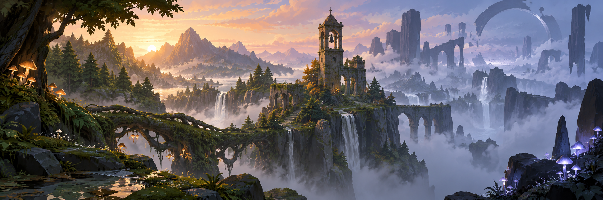

<!-- project-centered:start -->

<h1 align="center">Project Stillring</h1>

<!-- project-header:start -->

<!-- project-header:end -->

<!-- project-badges:start -->

  

<!-- project-badges:end -->

<!-- project-live-badges:start -->

  

<!-- project-live-badges:end -->

<!-- project-index:start -->

<h3 align="center">✦ Explore this project</h3>
<table align="center"><tbody><tr><td align="center"><a href="#readme-overview"><strong>Overview</strong></a></td><td align="center"><a href="#readme-what-we-are-making"><strong>What we are making</strong></a></td></tr><tr><td align="center"><a href="#readme-repository-map"><strong>Repository map</strong></a></td><td align="center"><a href="#readme-inspiration-policy"><strong>Inspiration policy</strong></a></td></tr><tr><td align="center"><a href="#readme-engine-policy"><strong>Engine policy</strong></a></td><td align="center"><a href="#readme-production-rule"><strong>Production rule</strong></a></td></tr><tr><td align="center"><a href="#readme-how-the-game-gets-built"><strong>How the game gets built</strong></a></td><td align="center"><a href="#readme-current-status"><strong>Current status</strong></a></td></tr></tbody></table>
<h4 align="center">Project shortcuts</h4>
<table align="center"><tbody><tr><td align="center"><a href="ROADMAP.md"><strong>ROADMAP</strong></a></td><td align="center"><a href="docs/00_PROJECT_CHARTER.md"><strong>00 PROJECT CHARTER</strong></a></td></tr><tr><td align="center"><a href="docs/01_GAME_VISION.md"><strong>01 GAME VISION</strong></a></td><td align="center"><a href="docs/15_CANON_TO_PLAY_PIPELINE.md"><strong>15 CANON TO PLAY PIPELINE</strong></a></td></tr></tbody></table>
<!-- project-index:end -->

<h2 align="center">Overview</h2>

**Working title:** Project Stillring  
**Genre:** Third-person fantasy action-adventure  
**Engine:** Unreal Engine 5.8  
**Primary implementation:** C++ core with thin Blueprint presentation  
**Primary implementation agent:** Claude  
**Target feel:** A late-1990s 3D adventure remembered through modern eyes: readable low-poly forms, deliberate fog, compact textures, strong silhouettes, tactile lock-on combat, puzzle-heavy dungeons, memorable towns, and a complete authored story.

Project Stillring is an **original IP**. It may study the design principles and evolution of classic-to-modern 3D action-adventure games, including the Zelda lineage, but it must not reproduce Nintendo characters, story, maps, music, dialogue, item designs, textures, code, ROM data, trademarks, exact control expression, or other protected expression.

<a href="#readme-index">↑ Back to index</a>

## What we are making

A 20–30 hour single-player adventure set in **Orra**, a world held together by a network of ancient civic bells. When the central bell is silenced, reality begins separating into the ordinary world and a soundless echo-layer called **the Hush**. The player, **Neris Vale**, is a young bellwright who survives the first catastrophe and becomes able to cross between those layers.

The game is built around five pillars:

<table align="center"><tbody><tr><td align="center">1</td><td align="center"><strong>Explore a coherent world</strong> — towns, roads, wilderness, ruins, shortcuts, secrets.</td></tr><tr><td align="center">2</td><td align="center"><strong>Read and master enemies</strong> — lock-on melee combat, defense, spacing, counters, tools.</td></tr><tr><td align="center">3</td><td align="center"><strong>Solve physical spaces</strong> — dungeons are machines, not hallways full of filler.</td></tr><tr><td align="center">4</td><td align="center"><strong>Gain verbs, not stat clutter</strong> — every major tool changes combat, traversal, or puzzle language.</td></tr><tr><td align="center">5</td><td align="center"><strong>Finish the story</strong> — every region, dungeon, ally, and mechanic serves a complete beginning-to-end narrative.</td></tr></tbody></table>

<a href="#readme-index">↑ Back to index</a>

## Repository map

<table align="center"><tbody><tr><td align="center"><code>CLAUDE.md</code> — authoritative operating contract for Claude.</td></tr><tr><td align="center"><code>ROADMAP.md</code> — evidence-gated milestones from concept to release.</td></tr><tr><td align="center"><code>docs/00_PROJECT_CHARTER.md</code> — scope and non-negotiables.</td></tr><tr><td align="center"><code>docs/01_GAME_VISION.md</code> — gameplay, visual, camera, combat, progression, accessibility.</td></tr><tr><td align="center"><code>docs/02_STORY_BIBLE.md</code> — canonical narrative index and authority chain.</td></tr><tr><td align="center"><code>docs/03_PRODUCTION_WORKFLOW.md</code> — actual game-development workflow, owner-review rules, conversation-to-repository capture, and definition-of-done gates.</td></tr><tr><td align="center"><code>docs/04_TECHNICAL_DIRECTION.md</code> — Unreal/C++ architecture, source-of-truth boundaries, save/state, testing, rendering, and performance.</td></tr><tr><td align="center"><code>docs/05_IP_GUARDRAILS.md</code> — clean-room/IP rules.</td></tr><tr><td align="center"><code>docs/06_CONTENT_MATRIX.md</code> — regions, dungeons, bosses, tools, narrative purpose.</td></tr><tr><td align="center"><code>docs/07_INITIAL_BACKLOG.md</code> — first implementation work in dependency order.</td></tr><tr><td align="center"><code>docs/08_RESEARCH_NOTES.md</code> — production, engine, and design-lineage research with source links.</td></tr><tr><td align="center"><code>docs/10_COMPLETION_MODEL.md</code> through <code>docs/14_PRESTIGE_AND_MASTERY_CONTENT.md</code> — completion, authored optional content, 100% route, upgrades, and mastery authority.</td></tr><tr><td align="center"><code>docs/15_CANON_TO_PLAY_PIPELINE.md</code> — source-of-truth pipeline: <strong>CANON → PRODUCTION → IMPLEMENTATION → VERIFICATION → PLAY</strong>.</td></tr><tr><td align="center"><code>docs/16_DEVELOPER_TOOLING_AND_MACHINE_QA.md</code> — developer console, named state presets, structured bug capture, and offline machine-assisted QA contract.</td></tr><tr><td align="center"><code>docs/17_ZELDA_DESIGN_LINEAGE_AND_CONTROL_PRINCIPLES.md</code> — player-control lineage/reasoning: the problems Stillring learns from Zelda without copying expression.</td></tr><tr><td align="center"><code>docs/18_PROJECT_DECISION_REGISTER.md</code> — living index proving where durable project decisions are recorded so chat history is never required as authority.</td></tr><tr><td align="center"><code>docs/19_ASSASSINS_CREED_MOVEMENT_LINEAGE_RESEARCH.md</code> — secondary traversal research input; not design authority.</td></tr><tr><td align="center"><code>docs/20_GATE1_LOCOMOTION_SPECIFICATION.md</code> — final-owner-approved Gate 1 locomotion behavior, accessibility implications, tuning boundaries, and canonical human feel test.</td></tr><tr><td align="center"><code>docs/21_IN_GAME_SYSTEM_IDE_CONTRACT.md</code> — shared in-game developer shell + per-system IDE/workbench contract so Stillring can be authored, tuned, inspected, validated, reset, and iterated while the game is running.</td></tr><tr><td align="center"><code>docs/story/</code> — final scene, reveal, objective, dialogue, character, regional, pacing, recurrence, and side-interaction narrative contracts.</td></tr><tr><td align="center"><code>game/</code> — Unreal project root; intentionally skeletal until Gate 1 bootstrap.</td></tr></tbody></table>

<a href="#readme-index">↑ Back to index</a>

## Inspiration policy

**Ocarina of Time is a root reference, not the 2026 control ceiling.**

Stillring studies what Nintendo learned across later 3D Zelda games—free camera ownership, movement flow, route agency, readable affordances, target-lock evolution—then invents its own implementation for an authored Stillring world.

The governing player-control idea is:

<em><strong>Simple intention, capable character, honest world.</strong></em>

Stillring keeps authored progression and meaningful traversal verbs rather than automatically adopting universal climb-everything traversal. If the world visually implies an action should work, gameplay should support it or clearly communicate the exception.

<a href="#readme-index">↑ Back to index</a>

## Engine policy

Stillring uses Unreal because the project is now clearly a substantial authored 3D action-adventure with heavy animation, cinematics, combat, world-state, and content-production demands.

That does **not** mean accepting Unreal defaults as the design.

<table align="center"><tbody><tr><td align="center">C++ owns authoritative gameplay and state.</td></tr><tr><td align="center">Blueprints remain thin where practical.</td></tr><tr><td align="center">Canon remains in repository contracts, not hidden in binary assets.</td></tr><tr><td align="center">Gameplay Ability System, World Partition, Data Layers, Nanite, Lumen, MetaHuman, and PCG are opt-in tools rather than automatic dependencies.</td></tr><tr><td align="center">Rendering must serve Stillring's deliberate low-poly/retro-modern identity, not generic Unreal presentation.</td></tr><tr><td align="center">Claude and all development automation are development infrastructure only; the shipped game has no model/API dependency.</td></tr></tbody></table>

A useful shorthand is:

<em><strong>Unreal executes the game. The repository defines what the game is supposed to do.</strong></em>

<a href="#readme-index">↑ Back to index</a>

## Production rule

**Do not build the whole game before proving one vertical slice.**

The first playable target is a 20–30 minute slice containing:

<table align="center"><tbody><tr><td align="center">one village exterior;</td></tr><tr><td align="center">one wilderness route;</td></tr><tr><td align="center">one compact dungeon;</td></tr><tr><td align="center">three enemy archetypes;</td></tr><tr><td align="center">one miniboss;</td></tr><tr><td align="center">one boss;</td></tr><tr><td align="center">lock-on combat;</td></tr><tr><td align="center">one traversal/tool unlock;</td></tr><tr><td align="center">one Hush-layer puzzle;</td></tr><tr><td align="center">dialogue/cutscene support;</td></tr><tr><td align="center">save/load;</td></tr><tr><td align="center">Stillring's representative low-poly final-ish art direction;</td></tr><tr><td align="center">music/SFX placeholders;</td></tr><tr><td align="center">controller support;</td></tr><tr><td align="center">state presets/debug entry points sufficient to reproduce important slice states;</td></tr><tr><td align="center">at least one automated representative smoke route.</td></tr></tbody></table>

If that slice is not fun, readable, stable, testable, and fast to produce, full production does not begin.

A second production rule is equally binding:

<em><strong>Build the system and its in-game IDE together.</strong></em>

Major gameplay/content systems that require repeated tuning, authoring, state inspection, reproduction, or validation must receive a dedicated development-only System IDE workbench registered into the shared in-game developer shell. IDE debt counts as feature debt; it is not deferred debug polish. Exact authority: `docs/21_IN_GAME_SYSTEM_IDE_CONTRACT.md` and Issue #58.

<a href="#readme-index">↑ Back to index</a>

## How the game gets built

Stillring is specified from the finished-game side backward. Canon describes what exists; production contracts convert that authority into playable slices; Claude implements bounded work; deterministic verification proves objective behavior; humans play the result and decide whether it actually works as a game.

The repository is authoritative. Chats and implementation sessions are temporary working context.

When a conversation settles a durable project decision, that decision is migrated into the appropriate repository authority before later work depends on it. `docs/18_PROJECT_DECISION_REGISTER.md` is the audit index for those decisions.

<a href="#readme-index">↑ Back to index</a>

## Current status

**Gate 0 — narrative/design foundation complete; engine migrated to Unreal Engine 5.8 before Gate 1.**

The beginning-to-end story, scene/reveal/objective/dialogue contracts, regional living-world material, completion model, canon-to-play process, developer QA contract, Unreal technical direction, modern player-control lineage, and decision-capture workflow are established.

**Issue #1 locomotion is fully specified, repository-reconciled, and FINAL OWNER APPROVED.** The exact contract and canonical five-minute-per-input-profile feel/regression gate live in `docs/20_GATE1_LOCOMOTION_SPECIFICATION.md`.

The in-game **System IDE architecture is also locked** in `docs/21_IN_GAME_SYSTEM_IDE_CONTRACT.md`; Gate 1 establishes the shared developer-shell pattern with the Locomotion IDE, and later systems must plug into the same architecture as they are built.

The next player-feel design work is **Issue #2 camera specification**, followed by Claude's Gate 1 Unreal bootstrap once camera authority is similarly complete. Production-scale world construction remains blocked until the graybox control foundation proves itself through human play.

<a href="#readme-index">↑ Back to index</a> · <a href="#readme-top">Back to top ↑</a>

<!-- project-centered:end -->
