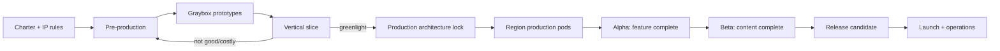

# 08 — Production Research Notes

Research date: 2026-09-03.

## What “developing a game” actually entails

A useful production model separates work into pre-production, production, post-production/polish, and post-release operations. Unity's production-cycle training describes pre-production as planning/prototyping/pipeline setup and the point where a design document becomes a shared source of truth; production covers creation of the interactive product and its assets; post-production emphasizes QA, testing, bug fixing and polish; operations covers the released product.

Sources:
- https://learn.unity.com/tutorial/explore-the-production-cycle?version=2022.3
- https://learn.unity.com/tutorial/the-real-time-production-cycle?version=2020.3

## Why Project Stillring uses a vertical slice

A vertical slice is a small playable portion demonstrating the major systems, features, and representative art of the whole game. This is different from a throwaway mechanic prototype: it tests whether the **production pipeline** can produce finished-feeling gameplay at a sustainable cost.

Sources:
- https://learn.unity.com/course/welcome-to-the-course/tutorial/explore-out-of-circulation?version=2022.3
- https://learn.unity.com/course/2d-roguelike-tutorial/tutorial/set-up-your-project?version=6.3
- https://unity.com/blog/how-playside-studios-built-kill-knight-visual-identity

## Why milestones are gate-based

Unity's production-planning material explicitly uses milestones such as an MVP/prototype, refinement milestones, and a final polish milestone, and recommends planning the work rather than treating all features as one undifferentiated build.

Source:
- https://learn.unity.com/tutorial/create-your-production-plan?version=2022.3

## Why Godot 4.7.2

Godot 4.7.2 was the current stable 4.x maintenance release on 2026-09-03 (released 2026-08-18). The project intentionally avoids the 4.8 development branch for production stability.

Source:
- https://godotengine.org/download/archive/4.7.2-stable/

## Why Godot fits an AI-assisted Git workflow

Godot's stable documentation describes the engine as VCS-friendly and generating mostly readable/mergeable files. It also recommends excluding `.godot/` generated cache data and describes Git LFS as appropriate for large textures, audio, and 3D models.

Sources:
- https://docs.godotengine.org/en/stable/tutorials/best_practices/version_control_systems.html
- https://docs.godotengine.org/en/latest/tutorials/best_practices/project_organization.html

GitHub's own documentation explains that Git LFS stores pointer files in Git while large objects live in LFS storage.

Source:
- https://docs.github.com/en/repositories/working-with-files/managing-large-files/about-git-large-file-storage

## Production conclusion

The project therefore follows this sequence:

The critical policy is simple: **uncertainty gets tested before expensive content is multiplied.**
